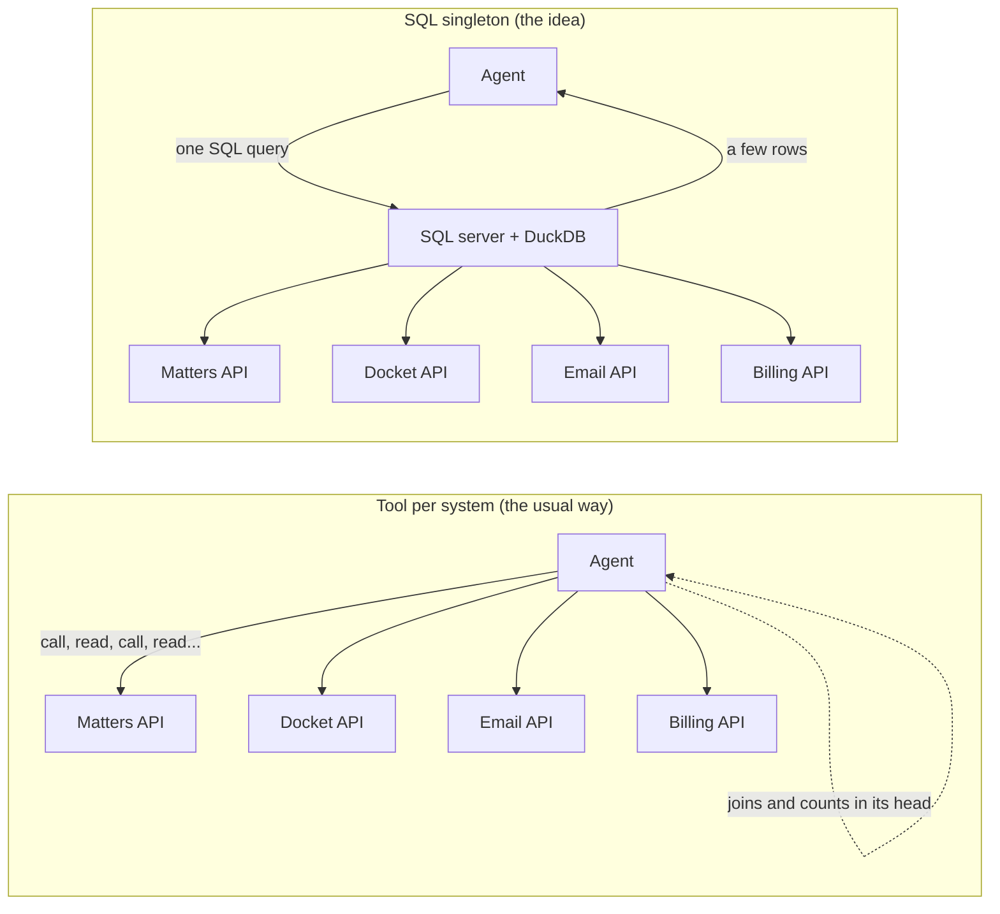
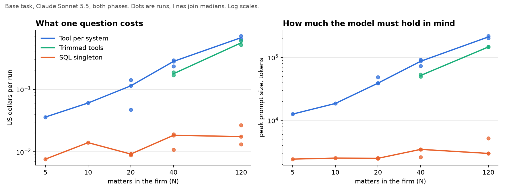
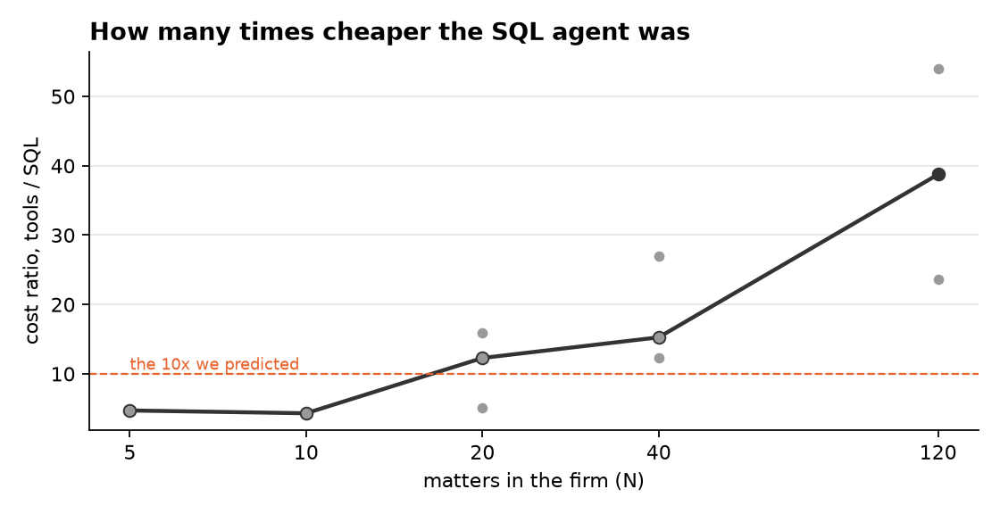
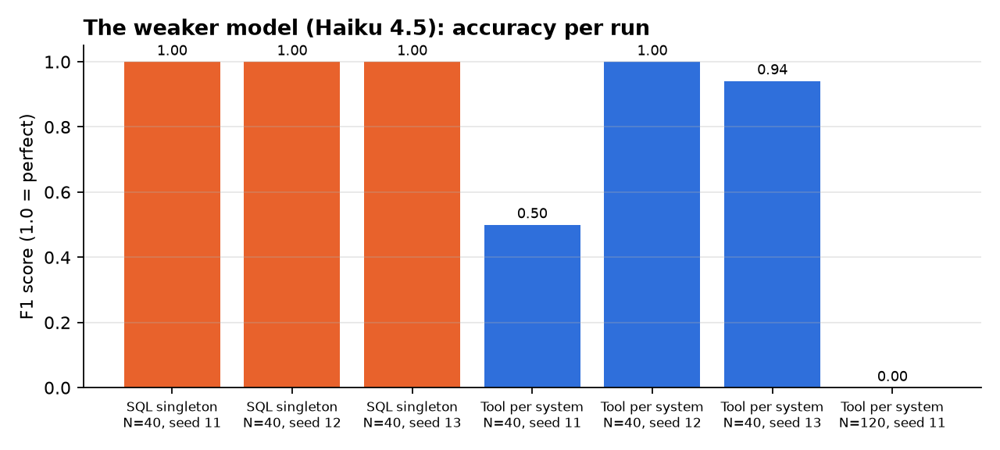

# The Tale of the One SQL Tool

*Or: how we spent $9.70 finding out whether an AI agent should stop asking so many questions.*

Every number below comes from the recorded runs in `results/`. The dry, complete version with every
table is in [WRITEUP.md](WRITEUP.md). This is the story.

---

## 1. Why we were curious

Picture an AI assistant at a law firm. Someone asks it:

> "Which of our active cases have a court deadline in the next three weeks, but nobody has emailed
> the client or billed an hour in the last two?"

A fine question. A terrifying one to answer, because the answer lives in **four different
systems**: the case list, the court docket, the email server, and billing. No single system knows.

The standard way to wire this up gives the agent one tool per system, usually through MCP (a
standard plug for connecting AI models to tools). The agent calls `list_matters`, then for each
matter calls `search_mail` and `list_time_entries` and `get_docket`, and then does the joining and
counting *in its own head*.

Here is the thing nobody tells you on the first day. **An LLM has no memory between turns.** Every
time it calls a tool, the entire conversation so far, including every raw JSON blob it has ever
fetched, is sent back to the model and read again. Turn 30 re-reads turns 1 through 29. If those
turns contain 5,000 tokens of Outlook JSON each, that is not a conversation. That is a landfill,
and you are paying rent on it every turn.

So we had a hypothesis. What if the agent got **one** tool that speaks SQL? The tool's server would
call the four systems, join everything in a real database engine, and hand back only the final
rows. The agent would see a dozen lines instead of a landfill.

We predicted, with the confidence of people who had not yet run anything:

- **10x fewer tokens** read, and about **10x faster**, at 20 or more cases.
- **2 to 5x fewer output tokens**, since the model would stop narrating joins.
- **Fewer wrong answers**, because hand-counting across pages of JSON is where hallucinated
  totals come from.
- Around **81 model turns** for the old way at 40 cases. (Remember this number. It will be
  humbling.)

## 2. Why anyone shipping agents should care

If you are building "Claude Code for X" or any agent that touches real business systems, your
bill is mostly **input tokens times turns**. Not output. Input, re-read, every turn. Costs grow
faster than linearly with the size of the data the agent wanders through, and a demo that costs
$0.05 at 10 records can cost dollars at 1,000. Latency grows with it, and so does the chance the
model quietly drops a row while adding up hours in its head.

Where you put the filtering and joining is therefore an architecture decision with a price tag.
This experiment was about measuring that price tag instead of guessing.

## 3. How we tested it

We could not use a real law firm (lawyers frown on that). So we built a fake one: **Harbor & Vale
LLP**, entirely fictional, with a data generator that produces any number of cases, plus realistic,
verbose JSON shaped like Clio, CourtListener and Microsoft Graph. Because we generate the data, we
always know the correct answer, so every run gets scored exactly.

We also planted **traps**: cases that look at risk but are not (deadline one day outside the
window, a closed case), and cases that look fine but are at risk (only emails were with the
*opposing* lawyers, only time logged was non-billable). If an agent misreads a rule, its score
drops.

Then two agents, same model (Claude Sonnet 5.5), same prompt, same data, same fake 150 ms delay
per API call:

| | Tool per system | SQL singleton |
|---|---|---|
| Tools it sees | `matters_list`, `docket_entries`, `mail_search`, `time_entries` | `describe_schema`, `sql_query` |
| Who joins the data | The model, in its context | The server, in DuckDB |
| What lands in context | Raw API JSON, page after page | Only the result rows |

We ran both at 5, 10, 20, 40 and 120 cases, logged every token, every tool call, every
millisecond, and scored every answer. The whole thing ran under hard spending caps, because the
account had $12 in it and we are not made of money.

Then, because a first result always looks better than it is, we sent the whole thing to a
skeptical reviewer, took the beating, and ran a **phase 2**: fresh data per run, no cache reuse
between runs, a third "trimmed tools" agent (per-system tools that return only the useful fields,
the fairest possible baseline), two harder task variants, and a repeat on a weaker model.

## 4. What we found

### The cost claim held. Loudly.

At 120 cases, the per-system agent cost **$0.63** and its biggest single prompt was **204,000
tokens**. The SQL agent cost **$0.02** and never showed the model more than about **5,000
tokens**. Paired, on fresh data with no cache tricks: **12 to 15x cheaper at 40 cases, 24x at
120**. The gap widens as the firm grows, which is exactly the shape you want to see.

(The two dots at 120 are the phase 1 run at 54x, which enjoyed some cache reuse, and the phase 2
run at 24x with none. We quote the honest one.)

Even the trimmed-tools agent, our best-case baseline, still cost **9 to 29x** more than SQL.
Field selection helps. It does not save you.

### The speed claim did not hold. And the reason is delightful.

We predicted 81 turns for the old way. Sonnet needed **3 to 5**.

It did not politely loop over cases one at a time like our mental model of a dumb agent. It
fetched the *whole mailbox* for the date window, and *all* time entries, in a few bulk, parallel
calls, then joined everything in one enormous context. Smart. Also the reason it cost 24x more:
it read all of that, every turn.

So the SQL agent was faster, but only **2 to 3x**, not 10x. Most wall time is spent waiting for
the model to think, and both agents do that.

### The accuracy claim did not separate them. Until we changed the model.

On Sonnet, **every answered run scored a perfect 1.00**, 20 of 20 in phase 2, traps included,
even on the harder variants. The model reads four rules correctly. It does not lose rows in its
head at this scale. Our "hallucinated totals" hypothesis was, at these sizes, simply not tested.

Two cracks did appear:

- **The arithmetic variant** ("fewer than 1.5 billable hours, or more than $4,000 unbilled")
  at 120 cases. The per-system agent's context hit **524,000 tokens**, it ran out of room for its
  reply, and it never answered, having spent **$1.68**. The SQL agent answered correctly for
  **$0.02**. `SUM()` is a hell of a drug.
- **The weaker model.** On Haiku 4.5, the SQL agent was perfect in all three runs. The
  per-system agent scored 0.50, 1.00 and 0.94 at 40 cases, and at 120 cases it handed back an
  **empty list**, missing all 29 at-risk cases.

That is the real accuracy lesson: the SQL layer does not make a strong model smarter. It makes a
**cheap model viable**.

### And where SQL was worse, because it was.

- The SQL server loads *everything* on its first query: **143 upstream API calls versus 45**.
  We model a slower, rate-limited upstream with ten times the mail history, and the per-system
  agent comes out **faster**. If your SQL layer cannot push filters down into the source APIs, it
  will drown at scale. This is the caveat that matters most for production.
- When deadlines were hidden in free-text court notes instead of a date field, SQL's own cost
  **tripled**. Still 4x cheaper than the alternative, but the schema someone hand-wrote for this
  question was doing a lot of quiet work.

## 5. What this means if you build agents

1. **Your bill is input tokens times turns.** Anything that keeps raw payloads out of context pays
   for itself immediately, and more so as data grows.
2. **Push filtering, projection and joins to the server.** The model should see answers, not
   evidence. A SQL layer is one way. A code-execution sandbox that calls tools and returns only
   results is another.
3. **Your baseline is smarter than you think.** Modern models batch and parallelize. Measure the
   real thing, not the strawman in your head. Our 81-turn prediction was off by 20x.
4. **The win is biggest for cheap models.** If you want to run Haiku-class models in production,
   this architecture is what lets you.
5. **Aggregation is the cliff.** The moment the task needs sums or counts across hundreds of rows,
   in-context joining stops being expensive and starts being impossible.
6. **Beware the full-table load.** A SQL facade that fetches everything is a different problem
   wearing a nicer hat. Predicate pushdown is the hard, unglamorous part.
7. **Cap your spend in code.** Every run here stopped itself at a dollar limit. Two runs got cut.
   That is $1 of tuition, not a $100 surprise.

## 6. Where we would go next

- **Messier data.** Client emails from unknown addresses, time zones that flip dates, one client
  with five cases. This is where hand-joining should start to leak.
- **A code-execution agent.** The model writes a script that calls the tools and joins in a
  sandbox. Same benefit as SQL, no hand-written schema. The fair three-way fight.
- **Predicate pushdown.** Make the SQL server lazy: only fetch what the query needs. Then rerun the
  "slow upstream" scenario for real, not modeled.
- **Many connectors.** With 40 systems the schema itself costs context. Does a discovery step
  ("which tables do I need?") keep the win?
- **The question as a human would ask it.** No numbered rules, no exact dates. Interpretation is a
  cost too.
- **More seeds.** We had one or two runs per cell at the big sizes. The direction is clear; the
  decimals are not.

## 7. Try it yourself

Everything is in this repo: the generator, both MCP servers, the runner with its spending caps,
every recorded run, and a static site that replays the two agents side by side so you can watch
one of them finish while the other is still reading email. See [README.md](README.md).

Total cost of the entire investigation, both phases, 43 runs: **about $9.70**. The cheapest
architecture decision you will make this year.

*Harbor & Vale LLP, its attorneys and its clients are fictional. No lawyers were harmed. One
budget was, slightly.*
